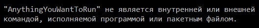
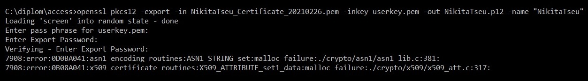
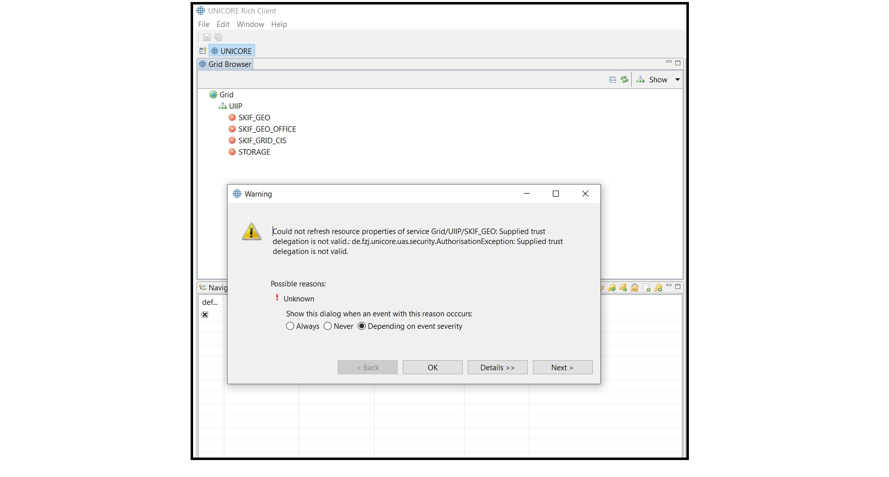
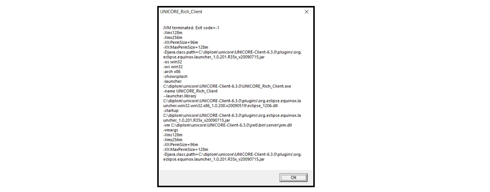

# UNICORE TROUBLESHOOTING GUIDE

Привет! В этом небольшом гайде я описал проблемы, с которыми вы можете столкнуться в процессе установки и настройки UNICORE, а также возможные способы их решения. Надеюсь, что он поможет сэкономить ваши нервы и время :)

Конечно, __лучше прочитать его до начала настройки__, потому что вместо того, чтобы исправлять ошибки, куда проще их сразу не совершать.

## Этап 1 - получение сертификата + создание хранилища ключей в формате _.jks_

#### Ошибка №1

__Причина:__ Если при попытке запустить что-либо (в частности для unicore скорее всего это будет _openssl_) в командной строке вы видите такую ошибку, то это означает, что система не знает, где искать соответствующий исполняемый файл.

__Решение:__ 
Существует два основных способа решить эту проблему:
* Добавить директорию, в которой лежит соответствующий исполняемый файл в системную переменную `PATH`. После вы сможете запускать свою программу просто набирая в терминале ее имя, как и пытались сделать до этого (система автоматически производит поиск по директориям, добавленным в `PATH`). 
* Вместо имени указывать при запуске полный путь к исполняемому файлу (например, вместо `openssl` вам нужно будет написать `"C:\path\to\my\file\openssl.exe"`)

__! Обратите внимание:__ если вы меняете переменную `PATH`, то чтобы эти изменения стали доступны в терминале, его нужно будет закрыть и открыть заново.

__! Обратите внимание:__ утилита _keytool_ входит в JRE, так что если вы вдруг не знаете, где ее искать - она находится в JRE в директории `\bin`.

---
#### Ошибка №2

__Причина:__ Вы используете устаревшую версию утилиты _openssl_

__Решение:__ [Скачайте](https://sourceforge.net/projects/openssl/files/) _openssl_ более высокой версии ( начиная с _v1.1.0f_ и выше )

__! Обратите внимание:__ если вы добавляли путь к _openssl_ в `PATH`, то либо удалите оттуда путь к старой версии и добавьте к новой, либо пользуйтесь вызовом через полный путь _(см. предыдущую ошибку)_. В противном случае система будет сканировать переменную `PATH` и использовать найденный там путь к старой версии.

 

## Этап 2 - настройка графического интерфейса UNICORE RichClient

#### Ошибка №3 

__Причина:__ Скорее всего, вы используете новую версию клиента. Дело в том, что новые версии имеют более строгие требования к хранилищу ключей, и вы просто не получите через них доступ к вычислительной сети.

__Решение:__ Используйте версию клиента 6.3.0.

---
#### Ошибка №4 (также может быть актуально, если у вас просто по непонятным причинам не запускается клиент)

__Причина:__ Несовместимая версия JRE.

__Решение:__ Чтобы клиент версии 6.3.0 работал, [скачайте](https://www.oracle.com/java/technologies/javase-java-archive-javase6-downloads.html) и установите 32-битную JRE 6 версии (32-битные версии имеют маркировку x86). Обратите внимание, что нужна именно 32-битная версия для совместимости с eclipce.

__! Обратите внимание:__ Путь к JRE должен быть добавлен в `PATH`. В качестве альтернативы можно запускать клиент через командную строку со специальной опцией (например `UNICORE_Rich_Client.exe -vm C:\jre\bin`, где `C:\jre\bin` это путь к JRE), но такой способ кажется не слишком удобным.

 ---
